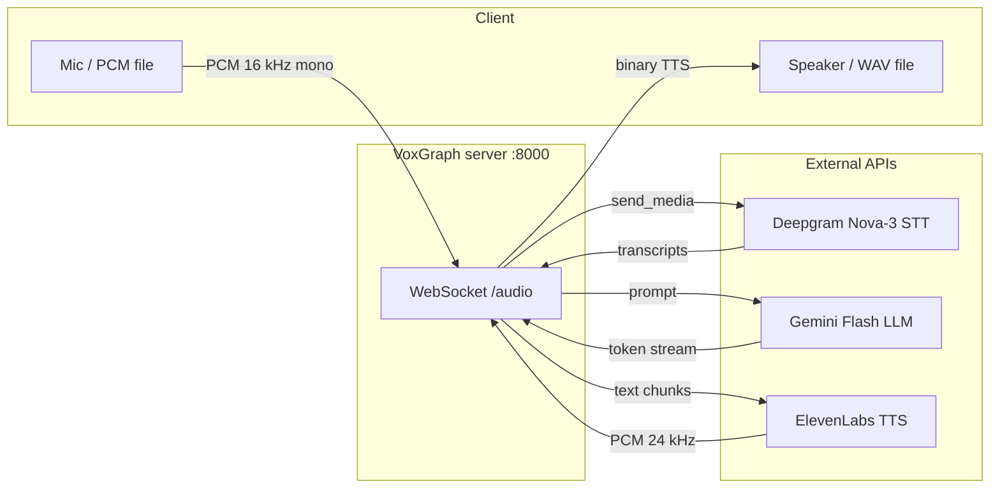
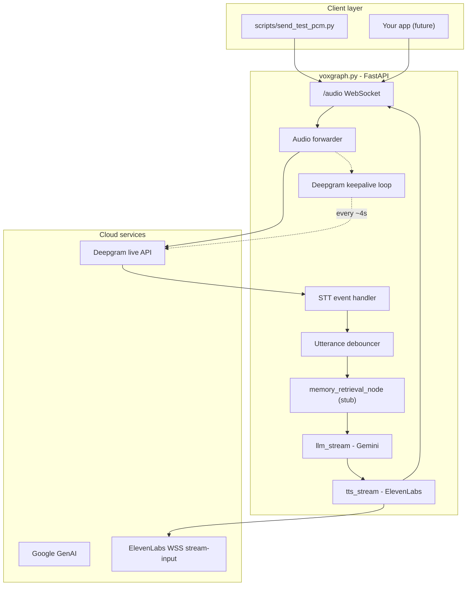
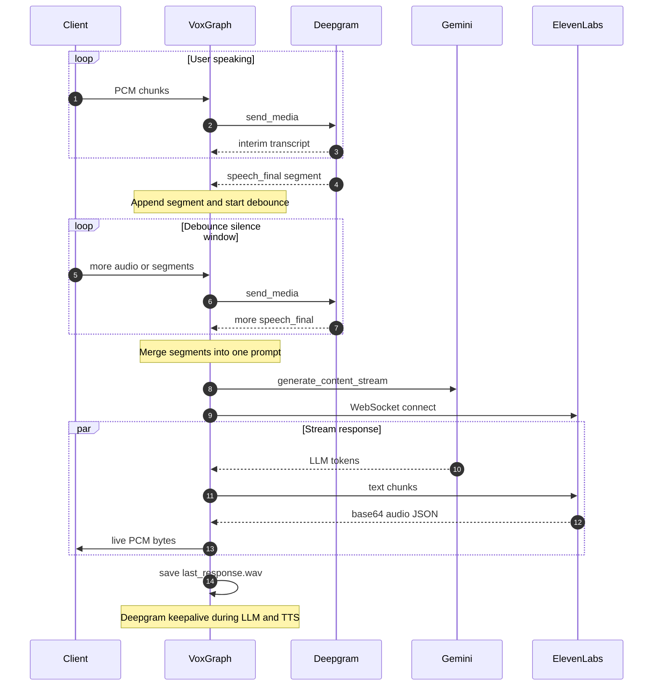
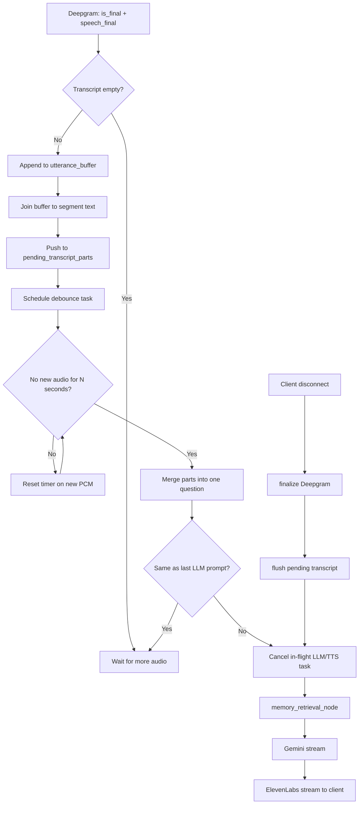
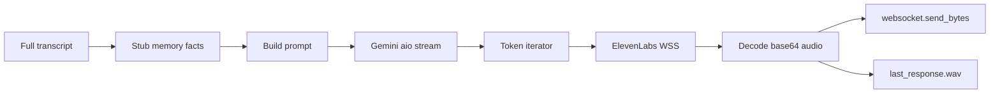

# VoxGraph

[](LICENSE)

**Real-time voice AI pipeline:** microphone or PCM audio -> speech-to-text -> LLM -> text-to-speech -> audio streamed back to the client.

Built with **FastAPI**, **Deepgram**, **Google Gemini**, and **ElevenLabs**. A hackable foundation for voice assistants, demos, and conversational agents.

---

## What is this?

VoxGraph is a **Python WebSocket server** that accepts raw PCM audio, transcribes it live, merges multi-segment speech after a debounce, generates a short reply with Gemini, synthesizes it with ElevenLabs, and **streams TTS audio back** over the same WebSocket.

---

## Architecture

### High-level pipeline



### System components



### End-to-end sequence (one question)



### Utterance merge and debounce

Handles multi-sentence questions (e.g. two `speech_final` events in one recording) without answering after the first phrase only.



### Response pipeline (streaming)



| Stage | Technology | Format |
|-------|------------|--------|
| Input | Client → `/audio` | linear16, 16 kHz, mono |
| STT | Deepgram `nova-3` | Live WebSocket, endpointing 300 ms |
| Debounce | asyncio task | Default 2.5 s silence (`UTTERANCE_DEBOUNCE_SEC`) |
| LLM | Gemini (`GEMINI_MODEL`) | Streaming tokens, short voice-style replies |
| TTS | ElevenLabs `stream-input` | `pcm_24000` default; JSON + base64 chunks |
| Output | Same WebSocket + disk | Live PCM to client; WAV on server |

---

## What can you use it for?

| Use case | How VoxGraph helps |
|----------|-------------------|
| Voice assistant prototype | End-to-end STT + LLM + TTS without wiring APIs yourself |
| Learning | WebSockets, streaming APIs, async Python |
| Hackathons | Swap models, prompts, memory; add any client on `/audio` |
| STT-only tests | `STT_ONLY=1` skips Gemini and ElevenLabs |
| Custom clients | Send **linear16 PCM**; receive binary TTS chunks |

---

## Project status

| Area | Status | Notes |
|------|--------|--------|
| Live STT (Deepgram Nova) | Done | Interim/final, endpointing, finalize on disconnect |
| Multi-segment questions | Done | Debounce merges phrases before one LLM call |
| Streaming LLM (Gemini) | Done | Token stream + model fallbacks |
| Streaming TTS (ElevenLabs) | Done | Base64 JSON decode, live stream, WAV save |
| Deepgram keepalive | Done | During long LLM+TTS |
| Test client | Done | `scripts/send_test_pcm.py` |
| Memory / RAG | Stub | Placeholder in `memory_retrieval_node` |
| LangGraph (live path) | Partial | Types exist; runtime uses direct async streams |
| Tool calling | Not started | |
| Web UI | Not included | WebSocket API only |
| Auth / production deploy | Not included | Dev-oriented |

**~70% of a minimal voice loop** - ready to extend, not production-hardened.

---

## Prerequisites

- Python 3.10+
- [Deepgram](https://console.deepgram.com/) API key
- [Google AI Studio](https://aistudio.google.com/apikey) API key (Gemini)
- [ElevenLabs](https://elevenlabs.io/) API key (optional with `STT_ONLY=1`)

---

## Quick start

```powershell
git clone https://github.com/suryaraj05/voxgraph.git
cd voxgraph
python -m venv .venv
.\.venv\Scripts\Activate.ps1
pip install -r requirements.txt
copy .env.example .env
# Edit .env with your API keys (never commit .env)
python voxgraph.py
```

Second terminal (use your own WAV - see `samples/README.md`):

```powershell
python scripts/wav_to_pcm.py path/to/your.wav samples/test.pcm
pip install sounddevice numpy   # optional live playback
python scripts/send_test_pcm.py samples/test.pcm
```

- Server: `http://0.0.0.0:8000`
- WebSocket: `ws://127.0.0.1:8000/audio`

---

## Audio contract

| Direction | Format |
|-----------|--------|
| Client -> server | Raw linear16, 16 kHz, mono (no WAV header) |
| Server -> client | Default PCM s16le 24 kHz (`pcm_24000`) |

Test client sends 4096-byte chunks and ~0.6s trailing silence for end-of-speech.

---

## Configuration

Copy `.env.example` to `.env`. Main variables:

| Variable | Default | Purpose |
|----------|---------|---------|
| `DEEPGRAM_API_KEY` | - | Speech-to-text |
| `GOOGLE_API_KEY` | - | Gemini LLM |
| `ELEVENLABS_API_KEY` | - | Text-to-speech |
| `GEMINI_MODEL` | `gemini-flash-latest` | LLM model id |
| `UTTERANCE_DEBOUNCE_SEC` | `2.5` | Silence before LLM |
| `STT_ONLY` | off | `1` = STT only |

---

## Repository layout

```
voxgraph/
├── voxgraph.py          # Main server (FastAPI + WebSocket /audio)
├── requirements.txt
├── .env.example
├── LICENSE
├── README.md
├── scripts/
│   ├── send_test_pcm.py # Test client (PCM in, TTS out)
│   └── wav_to_pcm.py    # WAV → raw PCM converter
└── samples/
    └── README.md        # How to add your own test audio (not committed)
```

| Path | Purpose |
|------|---------|
| `voxgraph.py` | Run with `python voxgraph.py` |
| `scripts/send_test_pcm.py` | End-to-end test against `/audio` |
| `scripts/wav_to_pcm.py` | Prepare PCM from any WAV |
| `.env.example` | Copy to `.env` and add API keys |

---

## Contributing

1. Fork and create a branch (e.g. `dev-yourname`).
2. Do not commit `.env` or API keys.
3. Open focused PRs (memory store, web UI, retries, Docker).

Repo: https://github.com/suryaraj05/voxgraph (branch `dev-surya`)

---

## Troubleshooting

| Symptom | Check |
|---------|--------|
| No transcripts | `DEEPGRAM_API_KEY`, 16 kHz mono PCM |
| Partial question answered | `UTTERANCE_DEBOUNCE_SEC`, trailing silence |
| Handshake timeout | ElevenLabs key/network; avoid Ctrl+C mid-request |
| Gemini 404 | Use `gemini-flash-latest` or `gemini-2.5-flash` |
| Silent PCM | Regenerate with `scripts/wav_to_pcm.py`; check peak in converter output |

---

## License

This project is licensed under the **MIT License** - see [LICENSE](LICENSE).

Copyright (c) 2026 Surya Raj. You may use, modify, and distribute the code with attribution.